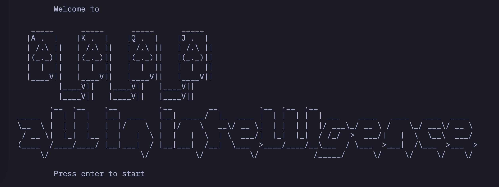
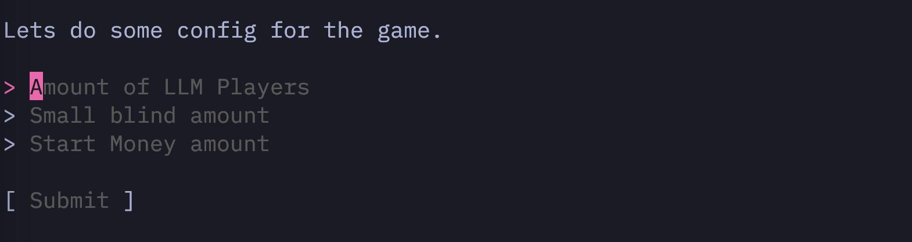
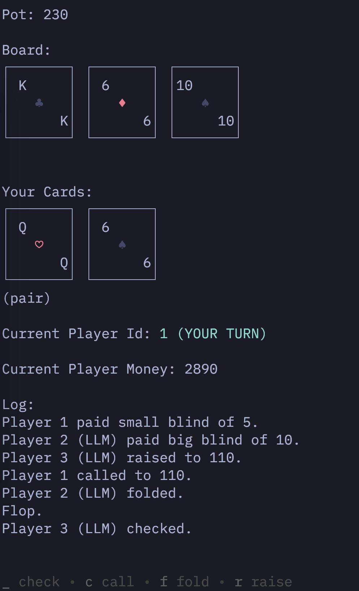

**All-In-Intelligence** is a text-based texas holdem poker game implemented in Go. The game leverages an interactive user interface (TUI) with visual styling and supports multiplayer gameplay through websocket connectivity.

## Description
All-In-Intelligence is designed to be played through a console or terminal, with options to:

- play against an LLM (Large Language Model) opponent
- play against other human players via websocket server connectivity

The terminal user interface leverages powerful Go libraries from [Charm](https://github.com/charmbracelet) for its experience.

## Prerequisites

To run this project, ensure you have the following:

- Go programming language installed on your system.
- OpenAi Api Key

## How to Play

To play, one player connects to the server, configures the game settings, and can start playing immediately. Additional players can join flexibly at any time and will be included in the next round of play.

## Configuration

Before starting the game, you will be prompted to configure the game. You can adjust various settings during this phase.

> Please note that you will need an OpenAI API key (e.g., as an os environment variable `OPENAI_API_KEY`) to play against an LLM player.

## Gameplay

Once configured, the game will begin, and you will see the user interface during gameplay.

