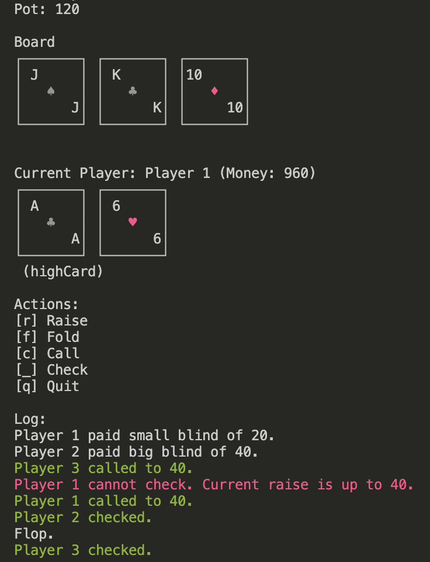

# All-In-Intelligence

**All-In-Intelligence** is a text-based texas holdem poker game implemented in Go. The game leverages an interactive user interface (TUI) with visual styling.

## Description

The Game is designed to be played through a console or terminal. It features an easy-to-use interface created using the TUI libraries **Bubble Tea** and **Lip Gloss**. The goal of the game is to test and improve your poker skills.

- **Bubble Tea**: Library used for building interactive console applications.
- **Lip Gloss**: Library used to enhance the design and styling of the user interface.

## Prerequisites

To run this project, ensure you have the following:

- Go programming language installed on your system.

## Use of the Project

1. Clone the repository:
    ```bash
    git clone https://github.com/p-obrthr/all-in-intelligence.git
    ```
2. Navigate to the source code directory:
    ```bash    
    cd all-in-intelligence/src
    ```
3. Run the project:
    ```bash
    go run main.go
    ```

---

